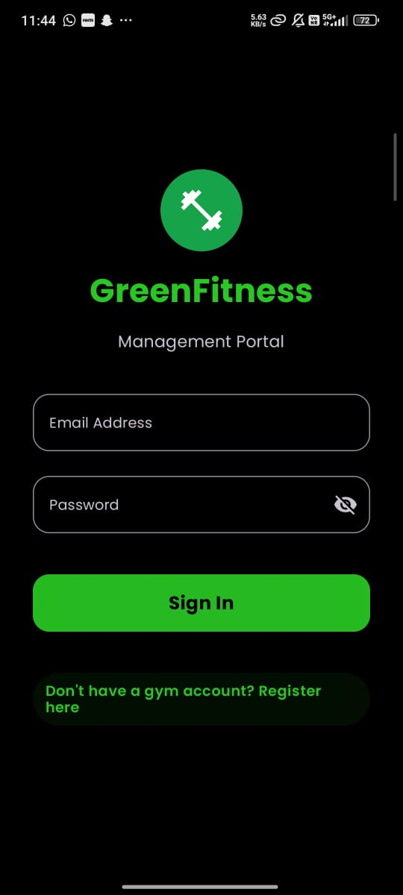
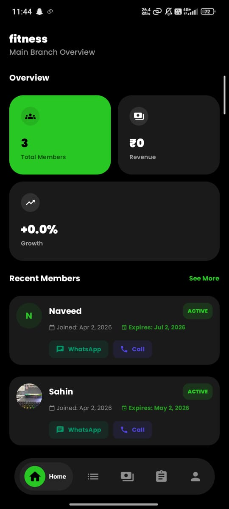
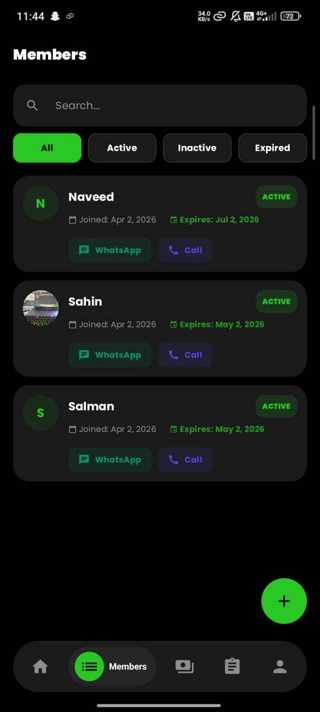
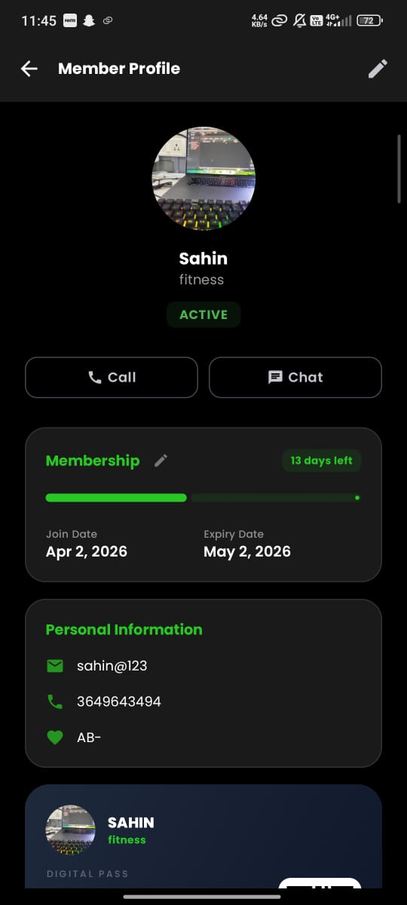
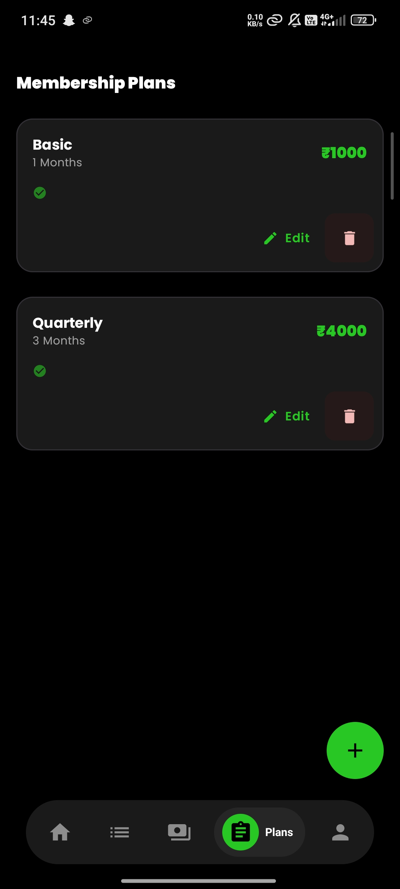
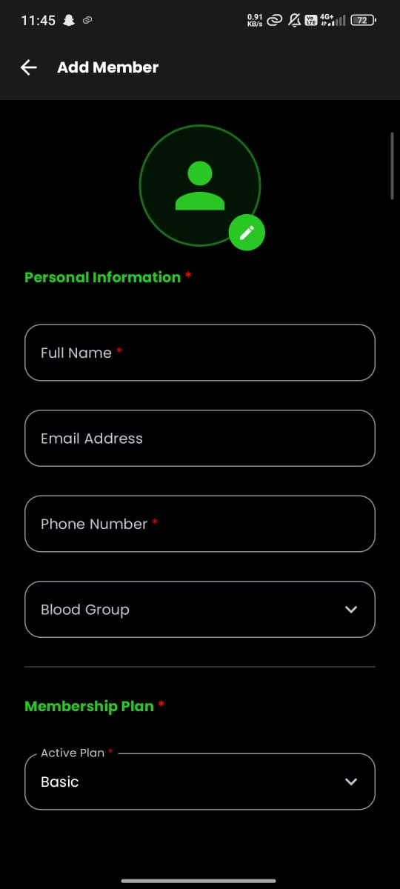
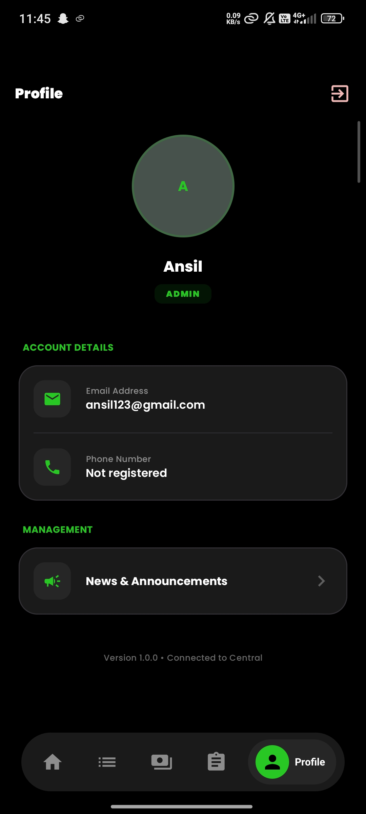

# 🏋️ GreenFitness — Gym Management System

A full-stack gym management system built end-to-end — cross-platform mobile app (KMP), RESTful backend, and an admin web dashboard. Designed to handle real-world gym operations: member management, membership plans, role-based access, and automated membership lifecycles.

> Built solo from idea → code → working product.

---

## 🌐 Live Backend

| | |
|---|---|
| **API Base URL** | https://full-stack-gymapp.onrender.com |
| **Status** | 🟢 Live & Running |
| **Hosted on** | Render |

---

## 📸 Screenshots

| Login | Dashboard | Members |
|-------|-----------|---------|
|  |  |  |

| Member Profile | Add Member | Membership Plans |
|----------------|------------|-----------------|
|  |  |  |

| Create Plan | Admin Profile |
|-------------|---------------|
|  |  |

---

## 📱 Mobile App — Kotlin Multiplatform (KMP)

Built with **Kotlin Multiplatform + Compose Multiplatform**, sharing 90%+ of business logic across Android and iOS from a single codebase.

**Tech Stack**
- Kotlin Multiplatform (KMP)
- Compose Multiplatform (UI)
- Koin (Dependency Injection)
- Ktor Client (API communication)
- Clean Architecture + MVVM

**Features**
- JWT-secured login with role detection (Admin / Member)
- Dashboard with total members, revenue, and growth metrics
- Member list with search + filter by Active / Inactive / Expired
- Member profile with membership progress bar, days left, and digital pass
- Add member with photo, personal info, blood group, and plan selection
- Create and manage membership plans (Basic, Quarterly, custom durations)
- WhatsApp and Call shortcuts directly from member cards
- Admin profile with news & announcements management

---

## 🛡️ Backend — NestJS + PostgreSQL

A production-grade REST API built with **NestJS**, backed by **PostgreSQL** via **Prisma ORM**. Deployed and live on Render.

**Tech Stack**
- NestJS (Node.js framework)
- PostgreSQL + Prisma ORM
- JWT Authentication
- Role-Based Access Control (RBAC)
- TypeScript

**Features**
- JWT-secured authentication with role-based access (Admin / Member)
- RBAC system controlling access across all endpoints
- Automated membership lifecycle — active → expiring → expired
- 10+ REST API endpoints covering members, plans, billing, and announcements
- Morgan request logging for full request traceability

---

## 💻 Admin Dashboard — Next.js

A web-based dashboard built with **Next.js** for gym admins to manage members and revenue in real time.

**Tech Stack**
- Next.js
- Recharts (data visualization)
- Tailwind CSS
- TypeScript

**Features**
- Real-time membership lifecycle overview
- Revenue and growth charts via Recharts
- Member CRUD — add, edit, deactivate
- Role-based UI visibility

---

## 🏗️ Project Structure

```
full_stack_gymApp/
├── GymApp/          → KMP mobile app (Android + iOS)
├── backend/         → NestJS REST API (live on Render)
└── dashboard/       → Next.js admin web dashboard
```

---

## 🚀 Running Locally

> The backend is already live at `https://full-stack-gymapp.onrender.com`.  
> Follow the steps below only if you want to run it locally instead.

### 1. Start PostgreSQL
```bash
brew services start postgresql@17
```

### 2. Backend (NestJS)
```bash
cd backend
npx prisma generate
npx prisma db push
npm run start:dev
# Runs at http://localhost:3000
```

### 3. Admin Dashboard (Next.js)
```bash
cd dashboard
npm run dev
# Runs at http://localhost:3001
```

### 4. Mobile App (Android)
- Open `./GymApp` in Android Studio
- Select the `composeApp` run configuration
- Launch an Android Emulator
- For local backend: app connects via `http://10.0.2.2:3000`
- For live backend: update base URL to `https://full-stack-gymapp.onrender.com`

---

## 👨‍💻 Built By

**Muhammed Ansil** — Android & KMP Developer  
[LinkedIn](https://linkedin.com/in/muhammed-ansil-810212269) · [GitHub](https://github.com/AnsilKM)
